# Nazca

A culture that existed 100 BC - 800 AD.
Famous for the lines in the high desert valleys. 

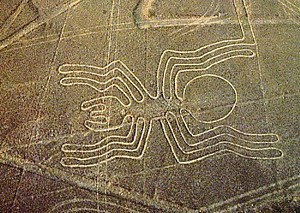
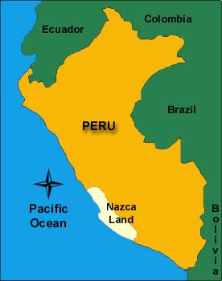

# Moche

A culture that existed 100 BC - 800 AD.
Advanced pottery and casting.
Some of the most erotic art in the ancient world.

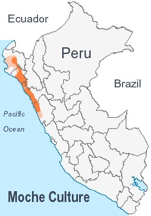
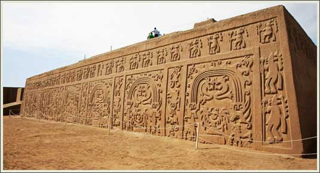

# Titicaca

The highest large/deep lake in the world.
Located at the border of Peru and Bolivia.
Center of the [Tiwanaku](https://en.wikipedia.org/wiki/Tiwanaku) civilization.

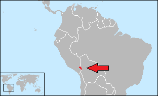

[google earth](https://www.google.com/maps/@-15.9003099,-69.4536199,211027m/data=!3m1!1e3)

# Anvi`o

[Eren, A. Murat, et al. "Anvi’o: An advanced analysis and visualization platform for ‘omics data." PeerJ 3 (2015): e1319.](https://peerj.com/articles/1319/)

Stands for advanced **an**alysis and **vi**sualization platform for **‘o**mics data.
Toolkit for visulization and analysis of metagenomic data.
Can bin co-assembled contigs into putative genomes and calculate sample-specific statistics.
These statistics are mapped along the genome in circular plots.
They test it on two data sets: infant gut microbiome over time and the response of ocean communities to oil spills.

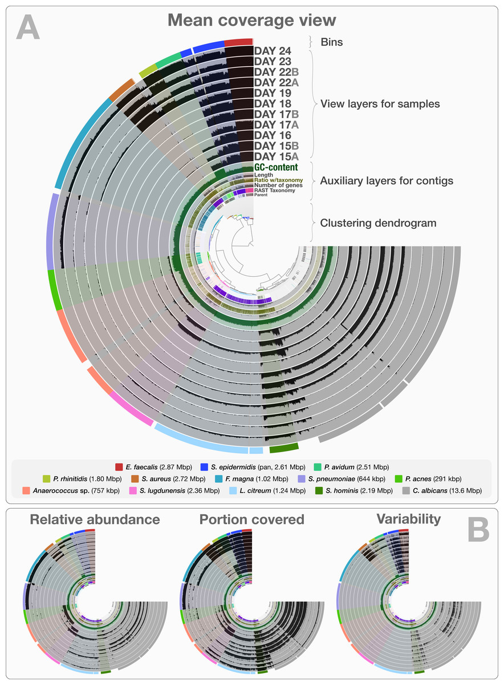

# Larch

The genus Larix.
A deciduous tree in the family pinaceae common in the cooler parts of the northern hemisphere. 
It is the dominant genus in boreal forests.

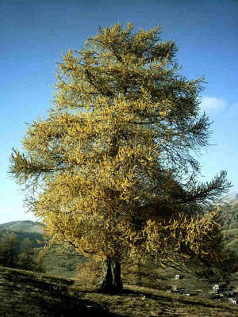
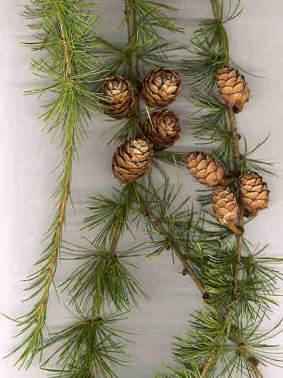
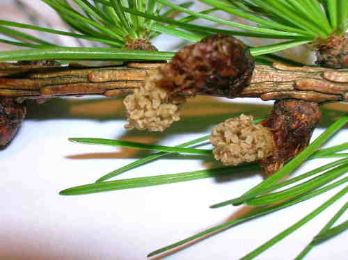

# Vettranio 2012

[Vettraino, A.M., Bonants, P., Tomassini, A., Bruni, N. and Vannini, A. (2012), Pyrosequencing as a tool for the detection of Phytophthora species: error rate and risk of false Molecular Operational Taxonomic Units. Letters in Applied Microbiology, 55: 390–396. doi: 10.1111/j.1472-765x.2012.03310.x](http://onlinelibrary.wiley.com/doi/10.1111/j.1472-765x.2012.03310.x/abstract;jsessionid=420926B8459963D6FEEBEA3EE56E3816.f02t03?userIsAuthenticated=false&deniedAccessCustomisedMessage=)

Used 454 sequencing on a mock community to determine the ability of 454 sequencing to detect pythium and phytophthora.
Used primers ITS6 and ITS7, but did not describe PCR conditions.
Recovered all species in mock community semi-quantitativly.
A blast identity threshold of 98% balanced reads matched and false OTUS.

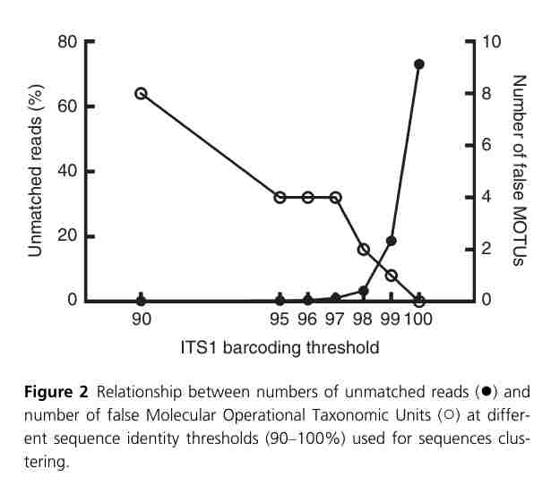

# Vannini 2012

[Pyrosequencing of environmental soil samples reveals biodiversity of the Phytophthora resident community in chestnut forests Andrea Vannini, Natalia Bruni, Alessia Tomassini, Selma Franceschini, Anna Maria Vettraino FEMS Microbiology Ecology Sep 2013, 85 3 433-442; DOI: 10.1111/1574-6941.12132](http://femsec.oxfordjournals.org/content/85/3/433.abstract)

Used 454 sequencing on 474 soil samples from the base of trees in two sites.
Also used baiting on the same soil samples. 
Samples were taken every other month for a year. 
Primers ITS6 and ITS7 were used with a hotstart polymerase.
Baiting and 454 sequencing recovered similar species, but each method had unique results.
P. ramorum was found using 454 sequencing but not baiting and the presence of its DNA was confirmed by PCR of diagnostic reagions.

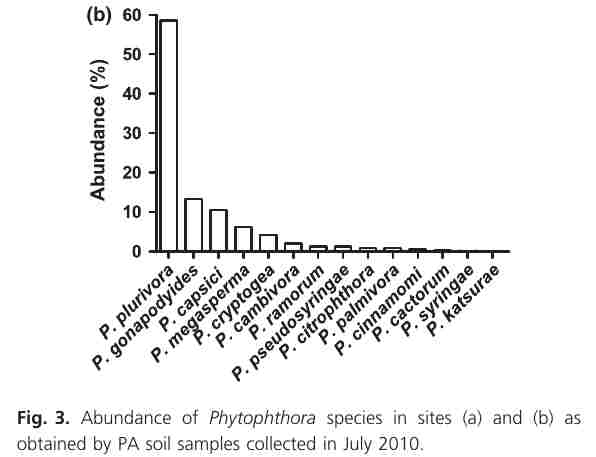

# Coince 2012

[Coince, Aurore, et al. "Below-ground fine-scale distribution and soil versus fine root detection of fungal and soil oomycete communities in a French beech forest." Fungal Ecology 6.3 (2013): 223-235.](http://www.sciencedirect.com/science/article/pii/S1754504813000032)

Used 454 sequencing to examine the spatial distribution of fungi and oomycetes in a Beech forest in France.
Primers ITS4 and ITS6, followed by ITS6 and ITS7 were used to amplify oomycetes; a standard Taq was used at a 53C annealing temperature.
Fungi were amplified using ITS1F and ITS2 with an annealing temperature of 53C.
Very few oomycetes were amplified; ITS6 and ITS7 amplified fungi instead.
There was an effect of distance between trees and the depth of soil sampling.
Root samples had similar results to the surrounding soil.

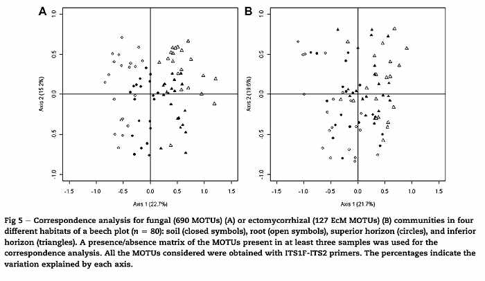
